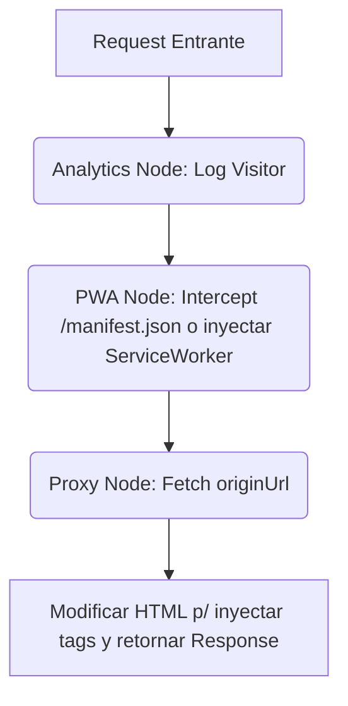

# Ejemplos de Workflows (workflows.md)

Los Workflows definen cómo los "Nodos" se conectan entre sí para lograr un caso de uso concreto en la aplicación. Este archivo actúa como registro y manifiesto de las automatizaciones de la app generada.

## 1. Pipeline HTTP Estándar (Proxy + PWA + Analytics)
Este es el workflow base para cualquier aplicación generada cuando haces `foldaa create <url>`.



## 2. Flujo de Pasarela de Pagos Protegida (Auth + Payments)
Generado por `foldaa add auth` y `foldaa add payments`.

```yaml
id: "checkout_flow"
trigger: 
  type: "http_request"
  route: "/api/checkout"
steps:
  - id: "auth_verification"
    node: "AuthNode"
    action: "verify_session"
    on_error: "redirect_to_login"
  
  - id: "create_payment"
    node: "PaymentNode"
    action: "create_checkout_session"
    inputs:
      price_id: "price_12345"
      user_id: "{{ auth_verification.outputs.user_id }}"
    
  - id: "redirect_response"
    node: "HttpNode"
    action: "redirect"
    url: "{{ create_payment.outputs.checkout_url }}"
```

## 3. Automatización Retención Asíncrona (Cron)
Generado al agregar automatizaciones y recordatorios.

```yaml
id: "daily_engagement"
trigger:
  type: "cron"
  schedule: "0 9 * * *" # Todos los días a las 9am
steps:
  - id: "fetch_inactive_users"
    node: "DatabaseNode"
    query: "SELECT email FROM users WHERE last_login < DATE('now', '-7 days')"
  
  - id: "send_email"
    node: "EmailNode"
    foreach: "fetch_inactive_users.outputs.rows"
    inputs:
      to: "{{ item.email }}"
      templateId: "we_miss_you_template"
```
